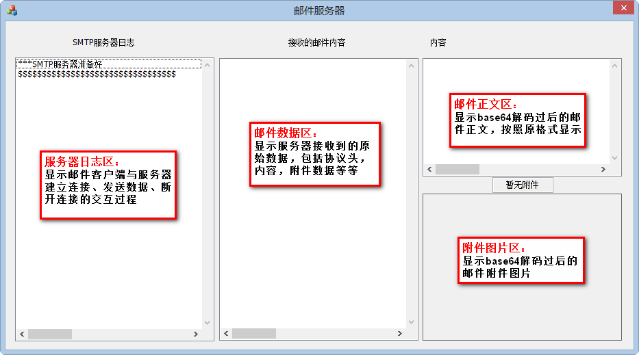
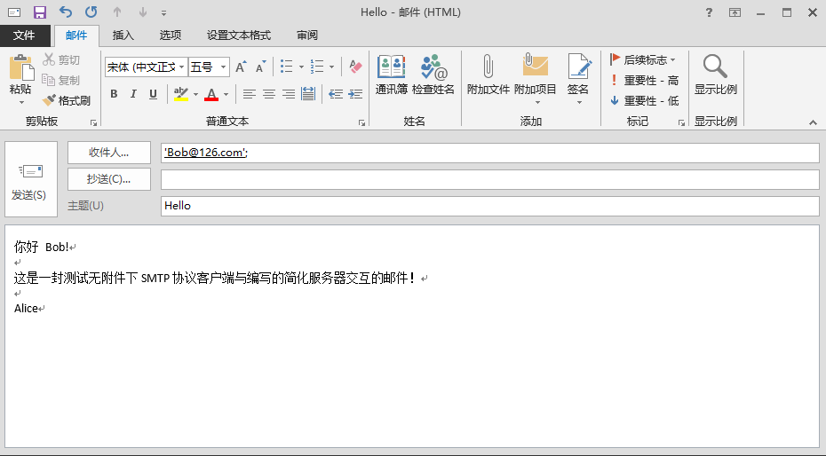
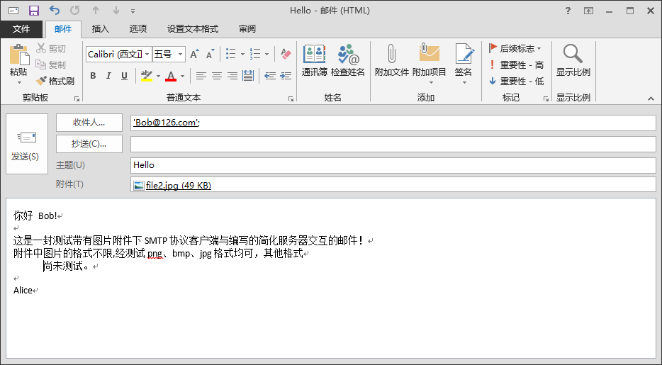
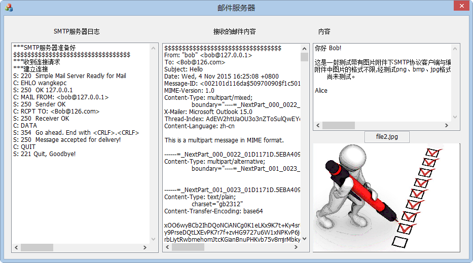

# 编写 SMTP 服务器并观察通信过程


## 一、 实验要求介绍

SMTP 和 POP3 协议是目前电子邮件应用系统中最重要的两个协议。深入理解 SMTP 和 POP3 协议的工作过程对理解整个电子邮件系统具有重要的意义。本实验要求编写一个简化的 SMTP 邮件服务器,通过观察电子邮件应用程序(如 Outlook Express 等)与 SMTP 邮件服务器的交互过程,加深对整个邮件服务系统的理解。

目的:观察电子邮件应用程序与 SMTP 邮件服务器的命令交互过程

要求:简化的 SMTP 服务器

-  响应客户 SMTP 命令,将命令的交互过程和收到的邮件显示到屏幕上
-  支持单用户
-  不保存和转发收到的邮件
-  不作错误处理
-  要求能显示客户端发送的图片。

## 二、 实验编译运行环境 

本程序编译环境是:Visual Studio 2012;系统环境是:Windows 8(64位);测试用 STMP 邮件客户端是 Outlook Express 2013;

## 三、 编写简化的 SMTP 服务器运行效果

1. 简化 SMTP 服务器界面及功能区介绍
	

	
2. 观察发送无附件的邮件
	- 在 Outlook Express 邮件客户端发送如下内容邮件:
	
	
	
	- 点击发送过后,在编写的简化 SMTP 邮件客户端上显示如下:

	
	
3. 观察发送带有图片附件的邮件
	- 在 Outlook Express 邮件客户端发送如下内容邮件

	
	
	- 点击发送过后,在编写的简化 SMTP 邮件客户端上显示如下:
	
	

````注意:邮件中图片附件在此简化的 SMTP 服务器上只能显示一张;格式为任意格式,经测试常见的图片格式如.png、.jpg、.bmp 均可支持;图片大小可任意大小,但是当图片大小大于 100K 时服务器会见过较长时间才能解码并显示在picture control 控件中。````

## 四、其他

实验原理和程序实现步骤及代码见代码和文档


